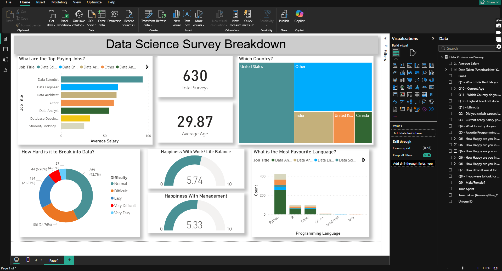
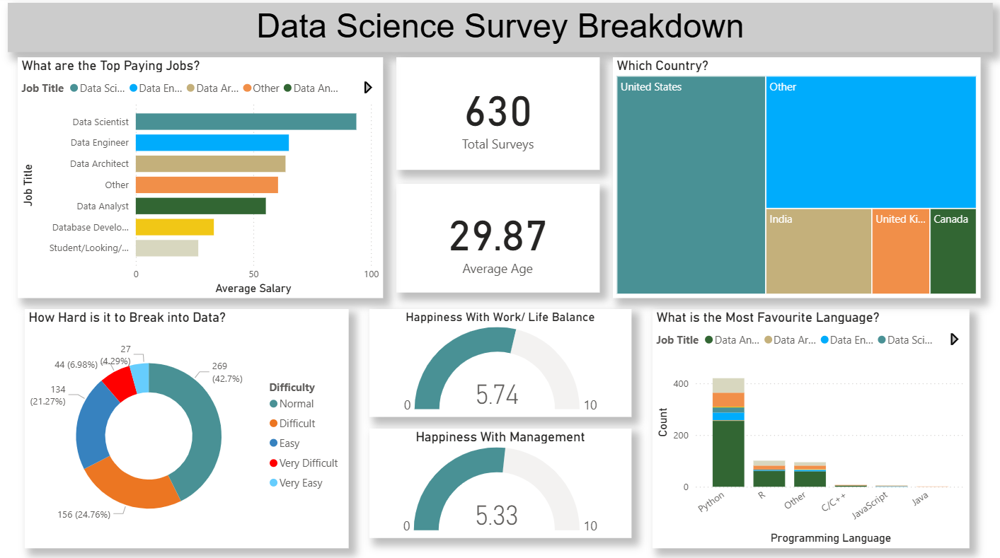

# Power BI Self-Learning Project 📊

This project documents my hands-on journey learning **Power BI** through the a YouTube course by [Alex The Analyst](https://www.youtube.com/watch?v=g0m5sEHPU-s&list=PLUaB-1hjhk8HqnmK0gQhfmIdCbxwoAoys).

## 🚀 What I Learned

Throughout this course and project, I developed practical skills in:
- 🔄 **Power Query** – data cleaning, transformation, filtering, and merging
- 🔗 **Data Modeling** – creating and managing relationships between tables
- 🧠 **DAX (Data Analysis Expressions)** – calculated columns and measures
- 🔎 **Drill-Downs & Hierarchies** – building interactive visual exploration paths
- 🎯 **Conditional Formatting** – dynamic formatting based on data values
- 📦 **Bins & Lists** – grouping data for better insight segmentation
- 📊 **Data Visualizations** – cards, charts, slicers, and dashboards

## 💼 Project Highlight

In the final project, I worked with a dataset from a **survey of data professionals**, originally created and shared by **Alex The Analyst** on his YouTube channel. This dataset included information such as job titles, salaries, countries, tools used, and years of experience.

The project involved:
- Data transformation and cleaning in **Power Query**
- Creating a robust **data model**
- Applying **DAX** for analysis
- Designing an interactive **Power BI dashboard** to highlight insights

 ## 📸 Dashboard Preview

## 📁 Repository Contents

- `Project.pbix` – Final Power BI project  
- `Power BI - Final Project.xlsx` – Dataset from Alex The Analyst  
- `Screenshots/` – Dashboard preview images  
- `README.md` – This file

## 📚 Learning Resource & Data Credit

- 📺 Tutorial Series by: [Alex The Analyst](https://www.youtube.com/@AlexTheAnalyst)  
- 🗂 Dataset Source: [Survey of Data Professionals by Alex The Analyst](https://www.youtube.com/watch?v=g0m5sEHPU-s)

> All credits to **Alex The Analyst** for the original dataset and course content.

---

✅ This project helped me solidify my Power BI skills and build my first real-world data dashboard. I’m excited to keep learning and growing in data analytics!

